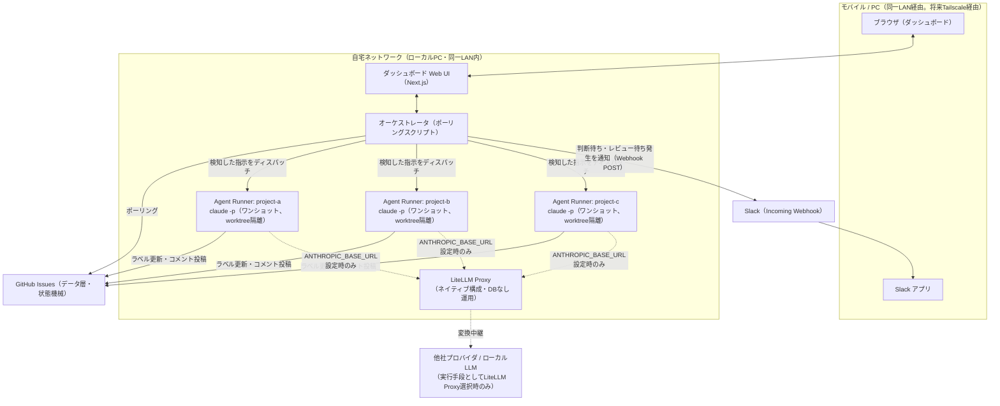

# アーキテクチャ設計書: 自走型AI開発オーケストレーションシステム（producer-desk）

- 対応issue: [#3](https://github.com/nosetech/producer-desk/issues/3)（親issue: [#1](https://github.com/nosetech/producer-desk/issues/1)、前提issue: [#2](https://github.com/nosetech/producer-desk/issues/2)）
- 作成日: 2026-08-03
- 前提: [要件定義書](./requirements.md)
- 前提となる調査: [architecture-and-challenges.md](https://github.com/nosetech/research-log/blob/main/log/2026/07/autonomous-dev-orchestration/architecture-and-challenges.md)（issue #64） / [poc-results.md](https://github.com/nosetech/research-log/blob/main/log/2026/07/autonomous-dev-orchestration/poc-results.md)（issue #65）

## 1. 全体構成

### 構成図



- 自走タスク本体の実行手段（Claude Code CLI直利用＋サブスクリプション／LiteLLM Proxy経由の他モデル・ローカルLLM＋従量課金）はプロジェクトごとにユーザーが選択できる（[5章](#5-モデルルーティング)参照）。LiteLLM Proxyはネイティブ構成（Docker不使用）で自宅ネットワーク内に導入し、実行手段としてLiteLLM Proxy経由が選択された場合のみAgent Runnerからの経由先となる（未選択時は素通しでClaude Code CLIが直接Anthropic APIへ接続する）。
- ダッシュボードへのアクセスは**MVPでは同一LAN内アクセスのみ**で保護する（[8章](#8-ネットワーク構成)参照）。外出先からのTailscale経由アクセスは将来拡張とする。Slack通知はオーケストレータからのWebhook送信のみで、ローカルネットワークの外（Slack社インフラ）を経由する点に留意する。

### コンポーネント一覧と責務

| コンポーネント | 責務 | 技術 |
|---|---|---|
| ダッシュボード（Web UI） | 判断待ち一覧／活動ログ／利用量・リミットモニターの表示、ワンタップ承認の入力 | Next.js（React） |
| オーケストレータ | GitHub Issuesのポーリング、状態集約、指示コメントの検知・ディスパッチ、Slackへの通知送信 | Pythonポーリングスクリプト（PoC-Aの`instruction_watcher.py`を発展） |
| Agent Runner | 実際にコードを書く実行単位。プロジェクトごとにgit worktreeで隔離し、ディスパッチ時にワンショットで起動 | Claude Code CLI（`claude -p`） |
| LiteLLM Proxy | Agent Runnerの実行手段としてLiteLLM Proxy経由が選択された場合のみ、Claude Code CLIの接続先を他社プロバイダ・ローカルLLMへ変換中継する（選択されない限り経路に入らない） | Python（`litellm[proxy]`、ネイティブ構成） |
| データ層 | タスク状態・指示履歴の正 | GitHub Issues/Projects |
| 通知 | 判断待ち・レビュー待ち発生時にモバイルへ知らせる（ダッシュボードでの定期確認運用が基本、Slackは補完） | Slack（Incoming Webhook） |

### コンポーネント間の通信方式

- オーケストレータ⇄GitHub間、オーケストレータ⇄Agent Runner間ともに**ポーリングに統一**する。
- Webhook/GitHub Appは、外部から到達可能な公開エンドポイント（またはsmee.io等のトンネル）を必要とし、「ローカルPC完結・同一LAN内」という前提と相性が悪いため採用しない。

## 2. エージェント実行基盤

- ローカルPC常駐方式を採用する。Claude Agent SDKによる自作Runnerは行わず、**Claude Code CLIをそのまま利用**する。
- **起動方式はワンショット実行**とする。オーケストレータが指示コメントを検知するたびに、対象プロジェクトのworktreeをカレントディレクトリとして `claude -p "<指示内容>" --resume <session-id>` を都度実行し、実行完了後プロセスは終了する。
  - アイドル時にプロセスが常駐しないためリソース効率が良い。
  - セッションの継続は `--resume` によるセッション再開を基本とし、必要に応じてissue本文・コメント履歴をコンテキストとして渡す設計とする。
  - [要件定義書 2-4](./requirements.md#2-4-agent-runnerの起動停止プロジェクト追加時の運用フロー)の「CLIコマンドによる手動起動・停止」は、この方式では「プロジェクトをRunner対象として有効化／無効化する」（オーケストレータのポーリング対象に含めるかどうか）という意味に読み替える。実際のプロセス実行はディスパッチ時のみ発生する。
  - 同一プロジェクトに対して指示（承認・自由記述・新規タスク作成）が実行中に追加で届いた場合は、オーケストレータ側でプロジェクト単位のキューに積む。実行中の `claude -p` プロセスが終了してから、キューの先頭の指示で次のディスパッチを `--resume`付きで行う（同一worktreeで複数の `claude -p` を同時実行しない）。
- **プロセス分離方式**: プロジェクトごとにgit worktreeで隔離する。コンテナ（Docker）による隔離は[9章](#9-実行環境)の理由によりMVPでは採用しない。

## 3. タスク・状態管理

- 独自DBは新設せず、**GitHub Issue/Projectsを正**として扱う。
- 状態遷移は単一の状態ラベルを付け替える方式とし、同時に複数の状態ラベルが付与されることはない：

  ```
  status:todo → status:in-progress → needs-human-decision → status:in-review → (close)
  ```

  - 未着手: `status:todo`
  - 作業中: `status:in-progress`
  - 判断待ち: `needs-human-decision`（[要件定義書 2-2](./requirements.md#2-2-判断が必要な項目の判定規約)で確定済みのラベル）
  - レビュー待ち: `status:in-review`（PR作成済み）
  - 完了: ラベルではなくissueクローズで表現する

- **冪等な状態遷移設計**: PoC（[poc-results.md](https://github.com/nosetech/research-log/blob/main/log/2026/07/autonomous-dev-orchestration/poc-results.md) 1章）で `gh issue edit --remove-label X --add-label Y` が非atomicであることが判明している。オーケストレータ・Agent Runner双方とも、ラベルを更新する際は**現在のラベル状態を確認してから、必要な操作だけを個別に実行する**設計とし、失敗時にリトライしても安全な冪等操作にする。

## 4. ダッシュボード・オーケストレーション

- **データ層**: GitHub APIのポーリング（[1章](#1-全体構成)参照。Webhookは不採用）。
- **表示層**: Next.js（React）を採用する。1人運用・ローカルPC常駐が前提のため大規模なバックエンド分離は不要だが、将来のワンタップ操作等のUI拡張のしやすさを優先する。
- **AIへの指示導線**: 案A（GitHub issueコメント経由）でMVPを構築する。ダッシュボード上のワンタップ承認、および自由記述のテキストボックスによる指示（[要件定義書 2-7](./requirements.md#2-7-承認自由記述による指示出しの要件)）は、いずれも内部的にはissueへのコメント投稿として実装する。
  - 自由記述の指示は、既存issueの状態を問わず送信できる（作業中への割り込み指示を含む）。実行中のプロジェクトへの指示は[2章](#2-エージェント実行基盤)のキューイングに従い、次回ディスパッチ時に反映する。
  - 新規タスク（新規issue）の作成も同じ導線で行う。`gh issue create` でissueを作成した上で、即時ディスパッチ／todo登録のみのいずれかを選べるようにする。
  - 専用API（案B）は将来拡張とする。

## 5. モデルルーティング

issue #148での検討・設計判断フェーズ（issue #174はその結果のdocs反映）を経て、コード変更を伴う自走タスク本体を含め、実行手段をプロジェクトごとにユーザーが選択できる方針へ転換した。従来の「自走タスク本体はClaude Codeのみ」という制限は撤廃する（[要件定義書 2-5](./requirements.md#2-5-モデル選択方針)）。

- **実行手段の選択肢**:
  - **(A) Claude Code CLI直利用**: 従来通りAnthropic API従量課金は使わず、Claude Code Pro/Maxプラン等のサブスクリプションを利用する。
  - **(B) LiteLLM Proxy経由**: Claude Code CLIの接続先をLiteLLM Proxyへ切り替え、他社プロバイダのモデル・ローカルLLMを自走タスク本体の実行に利用する。この経路は（Claudeモデルを指定した場合を含め）Anthropic API従量課金相当の課金方式に切り替わる。
  - デフォルトはプロジェクトごとの設定に従い、issueコメントでの都度指示により一時的にデフォルトから変更できる（設定方式は[基本設計書 4章](./basic-design.md#4-モデルルーター設定設計)参照。設定画面自体は別issueで扱う）。
- **導入方式**: LiteLLM Proxyは[9章](#9-実行環境)のDocker不使用というMVP方針を踏襲し、ネイティブ構成（`pip install 'litellm[proxy]'`）でローカルPC上に導入する。
- **Claude Code CLIとの統合方式**: Claude Code CLIは環境変数`ANTHROPIC_BASE_URL`/`ANTHROPIC_AUTH_TOKEN`で任意のAnthropic Messages API互換エンドポイント（`/v1/messages`）に接続先を切り替えられる。LiteLLM ProxyはこのAPIを実装し、OpenAI/Gemini/DeepSeek/Ollama等への変換中継を行えるため、既存のAgent Runner起動方式（[2章](#2-エージェント実行基盤)の`claude -p ... --resume`ワンショット実行・worktree隔離）を作り替える必要はない。オーケストレータはサブプロセス起動時にこれらの環境変数を切り替えるだけで実行手段を変更できる（詳細は[基本設計書 3-1](./basic-design.md#3-1-起動パラメータ)参照）。`ANTHROPIC_BASE_URL`設定時はサブスクリプションOAuthではなく静的トークン認証になる点に注意する。
- **利用量計測・DBなし運用**: LiteLLM Proxyの利用量計測・仮想キー管理機能はPostgreSQLが前提だが、本システムは独自DBを増やさずSQLite（`config/usage.db`）に一本化する既存方針（[要件定義書](./requirements.md)、[3章](#3-タスク状態管理)参照）を維持するため、PostgreSQLは導入せずDBなし運用とする。カスタムコールバック（`litellm.integrations.custom_logger`）でリクエストごとの計測結果を既存の`orchestrator/orchestrator/usage_store.py`（SQLite `config/usage.db`）に統合記録する（詳細は[基本設計書 4章](./basic-design.md#4-モデルルーター設定設計)参照）。予算上限到達時の自動ブロック（DBが無いと機能しない機能）は不採用とし、可視化のみを目的とする。
- **ローカルLLMの補助的併用**（コードレビュー支援・デバッグ調査の下調べ・日本語ドキュメント生成）は、上記のLiteLLM Proxy導入後も変更しない。引き続きLiteLLM Proxyを経由せず、Agent Runner（Claude Code CLI）が直接呼び出す構成とする。モデルの利用可否確認（利用量メトリクス不要）はMCP `ollama-client`（ホスト単位で構成済み、`~/.claude.json`。DesignSync同様に追加のインフラ・認証フローなしで`claude -p`実行時から利用できる）でよいが、実際の生成呼び出しは後述の`ollama-bench`コマンド経由でOllama REST APIを直接叩く。自走タスク本体の実行手段選択（LiteLLM Proxy経由）とは目的・計測経路が異なるため統合しない。
  - 当初はAgent Runnerの本番経路もMCP `ollama-client`経由の生成呼び出し（`mcp__ollama-client__ollama_chat`）に統一し、メトリクス取得を目的としない構成としていた。しかしMCP `ollama-client`（サードパーティ`ollama-mcp`パッケージ）の`ollama_chat`ツールはOllama REST APIレスポンスから`message.content`のみを抽出して返し、`prompt_eval_count`/`eval_count`/`total_duration`等のメトリクスを破棄する実装であることが判明し、本番経路のローカルLLM利用量が利用量表示UI・`config/usage.db`に一切反映されない問題が起きた（issue #104で発覚、issue #107で対応）。人間によるモデル選定・性能検証のための手動ベンチマークで同じ制約に対応するために追加していた`orchestrator/orchestrator/ollama_bench.py`（`ollama-bench`コマンド、Ollama REST API `POST /api/chat`、`stream: false`を直接呼び出す）を、Agent Runner本番経路のローカルLLM生成呼び出しにも一本化して使うことで、`--record`オプションにより計測結果を`usage_store.py`（[基本設計書 2-2](./basic-design.md#2-2-データ取得仕様ポーリング)）の`config/usage.db`に統合して記録できるようにした。
- Claude/ローカルLLMの使い分けポリシーの実装方針は**Agent Runner側**に持たせる。オーケストレータはモデル選択ロジックを持たず、`--append-system-prompt`でタスク種別ごとの推奨ローカルLLMをAgent Runnerに指示し、実際にMCPツールを呼ぶかどうか・どのモデルを使うかはAgent Runner自身（Claude Code）が判断する（実装は[基本設計書 4章](./basic-design.md#4-モデルルーター設定設計)、タスク種別ごとの推奨モデルは[要件定義書 2-5](./requirements.md#2-5-モデル選択方針)参照）。

## 6. 通知・承認フロー

- Claude Code Remote ControlのPush通知は実機検証で信頼性が確認できなかった（[要件定義書 2-6](./requirements.md#2-6-通知要件)）ため、Remote Controlには依存しない。
- **Slack（Incoming Webhook）**を採用し、判断待ち・レビュー待ち発生時にオーケストレータからSlackへ通知を送信する。Claude Code純正のChannelsプラグイン（Telegram/Discord/iMessage）は使わず、オーケストレータが直接Slack Incoming Webhook URLへHTTP POSTする一方向通知とする（双方向の承認操作はダッシュボード側で行うため、Slack側での応答は不要）。
- 主な利用シーン（就寝前後の確認、PC前レビュー）を踏まえ、ダッシュボードでの定期確認運用を基本としつつ、Slack通知を即時性の補完として併用する。

## 7. 権限管理・安全対策

- Agent Runnerはプロジェクトごとにgit worktreeで隔離し、**worktreeディレクトリ内ではフル自動実行**（`--dangerously-skip-permissions` 相当）を許可する。
- worktreeディレクトリという境界自体を隔離の安全壁とし、コマンド単位でのホワイトリスト／ブラックリスト管理は行わない（実装コストと1人運用という運用体制のバランスを踏まえた判断）。
- コンテナによる追加隔離は将来拡張とする。

## 8. ネットワーク構成

- **MVPでは同一LAN（同一Wi-Fi）内からのアクセスのみ**を前提とし、ダッシュボード・Agent Runnerへのアクセスをネットワーク境界のみで保護する。外出先からの利用は想定しない。
- アプリケーションレベルの追加認証（Basic認証等）は設けない。
- **将来拡張**: 外出先からのアクセスが必要になった時点で、Tailscale経由のアクセスに対応する（別issueで実装。[要件定義書 4-2](./requirements.md#4-2-将来拡張とする範囲)参照）。mDNS/固定IPによる同一LAN限定アクセスの恒久化は採用せず、外出先対応はTailscale経由に一本化する想定。

## 9. 実行環境

- PoC環境ではDockerのネットワーク関連操作（`docker network create`等）が恒常的にハングする問題が確認された（[poc-results.md](https://github.com/nosetech/research-log/blob/main/log/2026/07/autonomous-dev-orchestration/poc-results.md) 2章）。本番PC環境での動作確認は未実施のため、MVPでは**Dockerを使わずネイティブ構成**（Homebrew/pip等）を採用する。
- 将来Docker採用を検討する場合は、実際に運用するPC環境で事前にネットワーク機能の動作確認を行う。

## 参考

- [要件定義書](./requirements.md)
- [architecture-and-challenges.md](https://github.com/nosetech/research-log/blob/main/log/2026/07/autonomous-dev-orchestration/architecture-and-challenges.md)
- [poc-results.md](https://github.com/nosetech/research-log/blob/main/log/2026/07/autonomous-dev-orchestration/poc-results.md)
